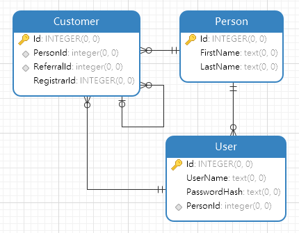

Massive.Extension
======================

A set of extra features for Massive ORM.

##### Support of static types
Although the art of Massive is its ability to work with dynamic objects and it should 
be used primarily, it could be helpful sometimes to have Massive work with static types
and when there is a need, you can simply use methods with generic types instead of dynamic
methods.

Be careful to use non-dynamic querying methods if you really need because they tent to
perform slower than their original counterparts.

##### Eager loading associations
There are two methods called QueryAndLink (one dynamic and one static) that allow you map each
row to multiple objects so you
can fetch objects and their associated objects altogether.

If you are familiar to Dapper, it is exactly what Multi Mapping does in Dapper.

Imagine whe have the following model:



As you see there is a super entity called Person and two sub entities (Customer and User).
Each Customer may have a referral customer (ReferralId), and a user who has registered them
in the system (RegistrarId).

On the code side, we have three classes:

```csharp
public class Person
{
    public long Id { get; set; }

    public string FirstName { get; set; }

    public string LastName { get; set; }
}

public class User
{
    public long Id { get; set; }

    public string UserName { get; set; }

    public string PasswordHash { get; set; }

    public long PersonId { get; set; }

    public Person Person { get; set; }
}

public class Customer
{
    public long Id { get; set; }

    public long PersonId { get; set; }

    public long ReferralId { get; set; }

    public Person Person { get; set; }

    public Customer Referral { get; set; }

    public long RegistrarId { get; set; }

    public User Registrar { get; set; }
}
```

Now we can fetch all customers with their personnal information usign the following code:
```csharp
var db = DynamicModel.Open("Default");
List<dynamic> customers = db.QueryAndLink(
    @"select c.*, p.*
      from Customer c
      inner join Person p on p.id=c.PersonId",
    1,
    (main, linked) =>
    {
        main.Person = linked[0];
    },
    false
).ToList();
```
AS you see, we have provided the SQL command, number of linked (associated) objects that are returned
from the SQL, the mapper function and the way objects are delimited in each row.

The mapper function is executed for each row and is provided by the main object (Customer in this example)
and an array of linked objects (which is only on instance of Person here). All associations must be done here.

Massive.Extension can can count on primary keys to delimit objects if their names are "Id". if not, the SQL
statement must return some splitter columns. Their names is defined by "SPLITTER_COLUMN" contant (which is __).

So the previous code can be rewrited as follows:
```csharp
List<dynamic> customers = db.QueryAndLink(
    @"select c.*, null as __, p.*
      from Customer c
      inner join Person p on p.id=c.PersonId",
    1,
    (main, linked) =>
    {
        main.Person = linked[0];
    },
    true
).ToList();
```

If you need to work with static objects the following code is the way to do so:
```csharp
List<Customer> customers = db.QueryAndLink<Customer>(
    @"select c.*, null as __, p.*
      from Customer c
      inner join Person p on p.id=c.PersonId",
    new Type[] {typeof(Person)},
    (main, linked) =>
    {
        main.Person = (Person)linked[0];
    },
    true
).ToList();
```

Note the method is now generic and instead of passing number of linke objects to the method , we have
passed an array which contains types of linked objects in the same order they appear in rows.

Now to get full data out of our database check the following code:
```csharp
string sql =
    @"select c.*, p.*, reg.*, regp.*, ref.*, refp.*
        from Customer c
        inner join Person p on p.id=c.PersonId
        inner join User reg on reg.id=c.registrarId
        inner join Person regp on regp.id=reg.PersonId
        left join Customer ref on ref.id=c.ReferralId
        left join Person refp on refp.id=ref.PersonId";

// dynamic
List<dynamic> dynamicCustomerNonSplitter = db.QueryAndLink(
    sql,
    5,
    (main, linked) =>
    {
        main.Person = linked[0];
        main.Registrar = linked[1];
        main.Registrar.Person = linked[2];
        main.Referral = linked[3];
        main.Referral.Person = linked[4];
    },
    false
).ToList();

// static
List<Customer> staticCustomerNonSplitter = db.QueryAndLink<Customer>(
    sql,
    new Type[] { typeof(Person), typeof(User), typeof(Person), typeof(Customer), typeof(Person) },
    (main, linked) =>
    {
        main.Person = (Person)linked[0];
        main.Registrar = (User)linked[1];
        main.Registrar.Person = (Person)linked[2];
        main.Referral = (Customer)linked[3];
        main.Referral.Person = (Person)linked[4];
    },
    false
).ToList();
```

##### Batch operations
You can have a collection of objects and perform insert / update / delete operations on them at once
by using InsertBatch / UpdateBatch / DeleteBatch.

Yes I konw Massive itself has a Save method but there are some differences between the two. Using
Save method there is no way to perform delete operation. Now you can use DeleteBatch method.

Also batch methods perform their operations using only one database command and therefor only on
round-trip to the database whereas Save method creates and sends one command per object to the
database.

lastly batch methods calls callback methods once by passing all the whole batch to callback methods.